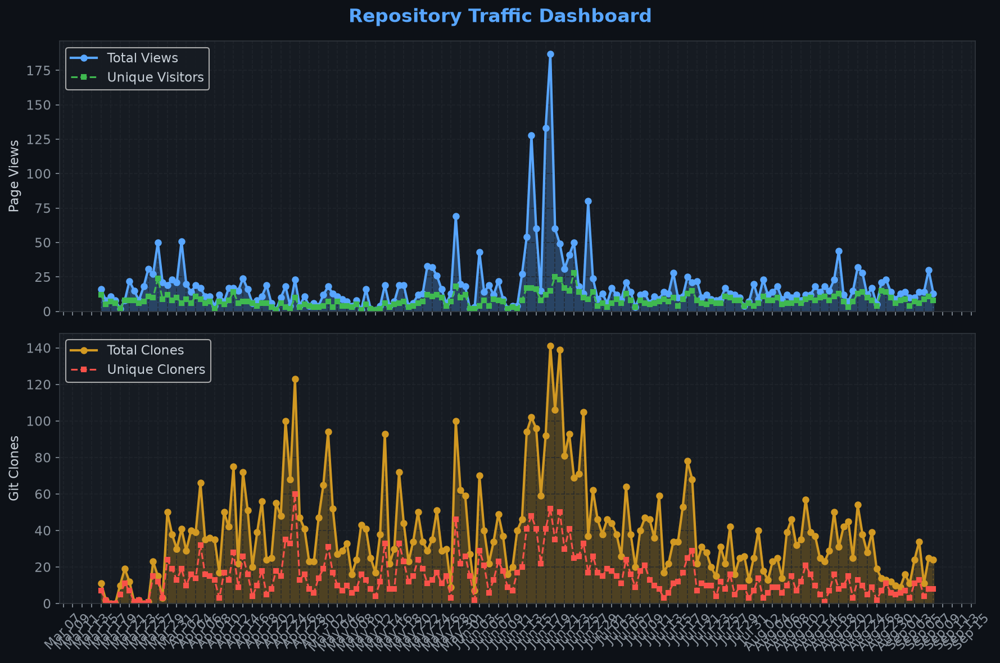
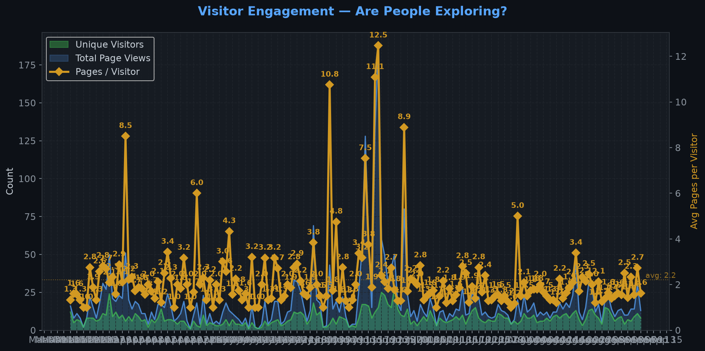
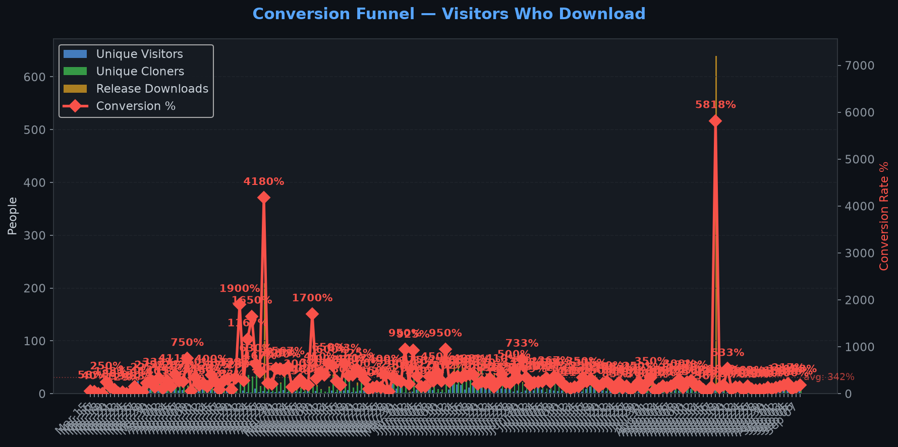
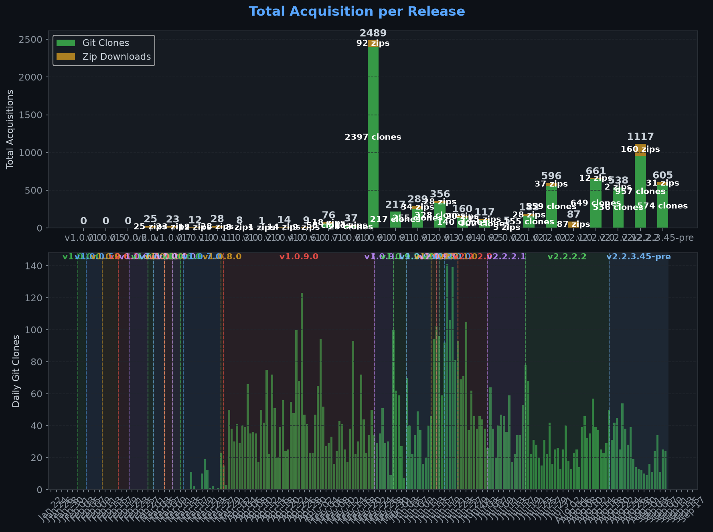
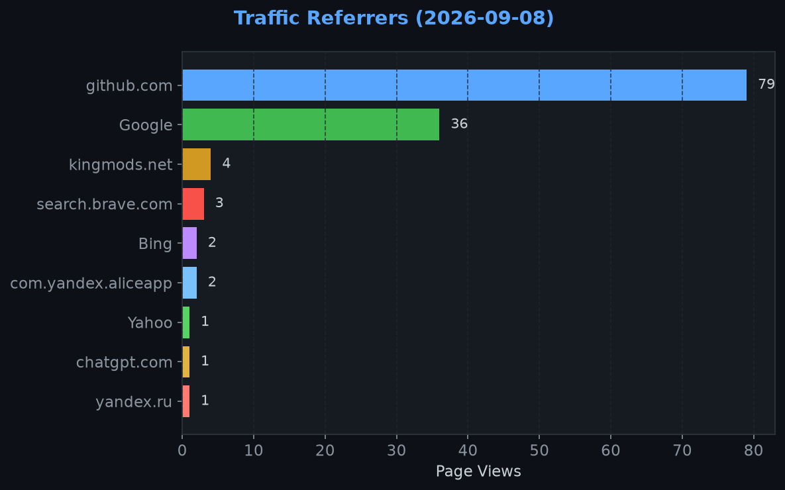
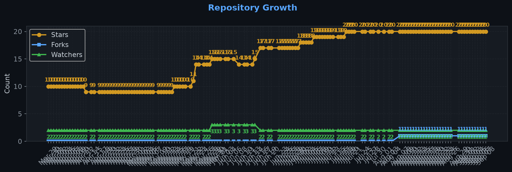

# Repository Traffic Dashboard

**Last updated:** 2026-09-08T12:28:51Z
**Days tracked:** 139 | **Download snapshots:** 608 (hourly)

---

## Views & Clones (14-day window, preserved forever)

| Metric | 14-Day Total | Unique |
|--------|-------------|--------|
| Page Views | 207 | 100 |
| Git Clones | 261 | 81 |

> **Engagement:** 2.0 pages per visitor (14-day avg)

---

## Visitor Engagement

> Higher = visitors exploring more pages. 1.0 = bounce. 3.0+ = deeply engaged.

---

## Conversion Funnel

> **14-day conversion:** 784 of 100 visitors cloned or downloaded (**784.0%**)
>
> Unique cloners: 81 | Release downloads: 703

---

## Total Acquisition per Release (Downloads + Clones)

| Channel | Count |
|---------|-------|
| Zip Downloads | 703 |
| Git Clones (14-day) | 261 |
| **Total Acquisitions** | **964** |

---

## Referrers

| Source | Views | Unique |
|--------|-------|--------|
| github.com | 79 | 42 |
| Google | 36 | 23 |
| kingmods.net | 4 | 4 |
| search.brave.com | 3 | 1 |
| Bing | 2 | 1 |
| com.yandex.aliceapp | 2 | 1 |
| Yahoo | 1 | 1 |
| chatgpt.com | 1 | 1 |
| yandex.ru | 1 | 1 |

---

## Repository Growth

| Metric | Current |
|--------|---------|
| Stars | 20 |
| Forks | 1 |
| Watchers | 2 |

---

## Top Pages (14-day)

| Page | Views | Unique |
|------|-------|--------|
| `/Realistic-Farming/FS25_WorkerCosts` | 110 | 89 |
| `/Realistic-Farming/FS25_WorkerCosts/releases/tag/v2.2.2.2` | 40 | 34 |
| `/Realistic-Farming/FS25_WorkerCosts/releases` | 15 | 10 |
| `/Realistic-Farming/FS25_WorkerCosts/releases/tag/v2.2.3.45-pre` | 5 | 3 |
| `/Realistic-Farming/FS25_WorkerCosts/blob/main/icon.png` | 4 | 4 |
| `/Realistic-Farming/FS25_WorkerCosts/tags` | 4 | 1 |
| `/Realistic-Farming/FS25_WorkerCosts/issues` | 2 | 2 |
| `/Realistic-Farming/FS25_WorkerCosts/pull/101` | 2 | 2 |
| `/Realistic-Farming/FS25_WorkerCosts/pull/109` | 2 | 2 |
| `/Realistic-Farming/FS25_WorkerCosts/pull/123` | 2 | 1 |

---

## Data Files

| File | Description | Granularity |
|------|-------------|-------------|
| [daily.json](daily.json) | Views & clones per day (never expires) | Daily |
| [downloads.json](downloads.json) | Release download snapshots | Hourly |
| [referrers.json](referrers.json) | Referrer snapshots | Daily |
| [metadata.json](metadata.json) | Stars, forks, watchers | Daily |
| [stats.json](stats.json) | Combined legacy snapshots | 6-hourly |

---
*Hourly download tracking + full dashboard with engagement metrics every 6 hours*
*Auto-generated by [traffic-stats.yml](../../.github/workflows/traffic-stats.yml)*
